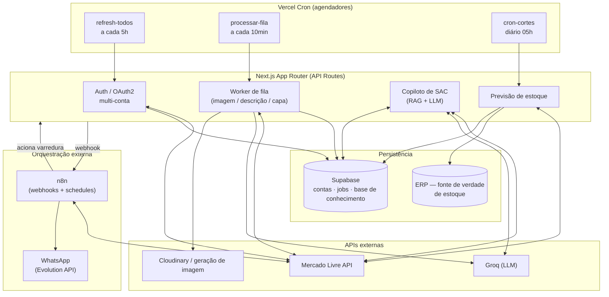

# Marketplace Automation Platform

> Plataforma de automação de operações para vendedores em marketplace (integração com a API do Mercado Livre): gestão multi-conta, enriquecimento de anúncios com IA, copiloto de atendimento (SAC) com RAG, e previsão de ruptura de estoque cruzando vendas com ERP.

**Aviso:** este repositório é uma vitrine técnica de portfólio. O código completo **não é público** e os dados aqui descritos são fictícios/mockados. Veja [Licença](#licença) e [Sobre este repositório](#sobre-este-repositório).

---

## Sumário

- [Contexto e problema](#contexto-e-problema)
- [Funcionalidades](#funcionalidades)
- [Stack](#stack)
- [Arquitetura](#arquitetura)
- [Principais desafios técnicos](#principais-desafios-técnicos)
- [Decisões de design e trade-offs](#decisões-de-design-e-trade-offs)
- [Resultados](#resultados)
- [Melhorias futuras](#melhorias-futuras)
- [Sobre este repositório](#sobre-este-repositório)
- [Licença](#licença)

---

## Contexto e problema

Operar dezenas de milhares de anúncios em **múltiplas contas** de um marketplace gera trabalho manual repetitivo e propenso a erro: responder perguntas de clientes, manter descrições e fotos padronizadas, e — o mais crítico — **não vender o que não tem em estoque**.

Esta plataforma centraliza essas operações em um painel único, automatizando as tarefas de maior volume e dando ao time visibilidade sobre risco de ruptura antes que ele aconteça.

São seis anos atuando dentro do e-commerce, até o nível sênior, que sustentam este projeto: conheço de perto as dores da operação, e construí a aplicação voltada para o uso direto no dia a dia — não como exercício teórico. Cada tela foi desenhada em torno dos dados que realmente importam para uma decisão; dado sem uso não serve para nada. A lógica foi sendo testada, conversada com quem opera e ajustada no código de forma contínua, até virar ferramenta de trabalho.

A formação em Ciências Contábeis se soma a essa vivência justamente na parte que mais separa este projeto de uma automação genérica: o tratamento fiscal e de margem. O cálculo de impostos — incluindo DIFAL por estado, com alíquotas próprias e os dois métodos de cálculo (por dentro e por fora) — foi modelado para chegar perto do real, alimentando tanto a precificação de anúncios quanto a DRE do dashboard.

---

## Funcionalidades

Os módulos abaixo refletem as áreas funcionais do sistema.

**Contas e autenticação**
- Conexão de múltiplas contas do marketplace via OAuth2, com renovação automática de tokens.
- Painel de saúde das contas: reputação, status operacional (a conta pode vender/anunciar?), reclamações e mediações abertas (com produto, comprador, valor e prazo), infrações/moderações ativas e SLA de perguntas sem resposta.

**Anúncios**
- Criação de anúncios em fluxo guiado (categoria, ficha técnica, dimensões, imagens, descrição).
- Espelhamento/clonagem de anúncios entre tipos (clássico/premium) com estratégia de fallback de GTIN e normalização automática de dimensões e atributos.
- Enriquecimento automático de descrição com IA (copywriting condicionado aos dados do produto).
- Preenchimento assistido de ficha técnica por IA, a partir dos atributos exigidos pela categoria.
- Padronização e reprocessamento de imagens, e geração de capa composta server-side.
- Detecção e recriação de anúncios "zumbis" (clona o anúncio defasado e encerra o original).

**Atendimento (SAC)**
- Copiloto que rascunha respostas a perguntas de clientes com RAG + LLM, imitando o tom da loja e com trava anti-alucinação.
- Base de conhecimento que aprende com as respostas aprovadas.

**Estoque e abastecimento**
- Previsão de ruptura cruzando vendas dos últimos 30 dias com estoque do ERP (dias de cobertura por SKU).
- Saúde do estoque no Mercado Livre Full: classificação por ruptura, excesso, sem giro e zerado, com motivos de indisponibilidade.
- Comparativo de cobertura de catálogo: aponta quais SKUs do ERP ainda não têm anúncio em cada conta.
- Rastreador por SKU / MLB no inventário.

**Operação e logística**
- Painel de pedidos em pipeline (a faturar → embalar → pronto → enviado), reconciliando status manual com o status do marketplace.
- Cálculo diário dos horários de corte de envio por conta (com tratamento de fuso e logística ME2).
- Geração de etiqueta (ZPL/PDF) e nota fiscal (DANFE), com disparo de **etiqueta + NF por WhatsApp** quando um pedido é processado.
- Resumo operacional diário enviado por WhatsApp em dias úteis.

**Preços, promoções e Ads**
- Motor de margem/precificação: calcula lucro por item considerando custo (ERP), frete real do anúncio, comissão real do marketplace por categoria/tipo, impostos e DIFAL — com preço-alvo sugerido e semáforo de viabilidade.
- Participação em campanhas e promoções em lote (aceitar oferta ou definir preço), com tradução dos erros da API.
- Análise de campanhas de Ads com IA: lê métricas (ACOS, TACOS, ROAS, funil) e gera diagnóstico em linguagem de negócio.

**Inteligência e análise**
- Dashboard operacional em tempo real (DRE consolidada, metas, ranking de contas, pedidos ao vivo).
- Auditoria de otimização de anúncios com IA (Llama): pontua título, ficha técnica, mídia, descrição e competitividade, calcula um score ponderado e gera um plano de ação priorizado por impacto para subir no ranking, com sugestões de título e gaps de atributos.

---

## Stack

| Camada | Tecnologia |
|---|---|
| Framework / Runtime | Next.js 16 (App Router), React 19, Node serverless |
| Banco / Auth | Supabase (Postgres, RLS, service role) |
| Hospedagem / Cron | Vercel (Serverless Functions + Cron Jobs) |
| IA / LLM (no produto) | Groq (Llama 3.1 / 3.3), Google Gemini (via Google AI Studio API) |
| Processamento de imagem | `sharp` (server-side), Cloudinary (transformações) |
| Geração de imagem | API de difusão para imagens de catálogo |
| Gráficos | Recharts |
| Orquestração / Integração | n8n (webhooks + agendamentos), WhatsApp via Evolution API |
| Apoio ao desenvolvimento | Assistentes de IA (Claude, Gemini, ChatGPT) usados como ferramenta de apoio à codificação |

---

## Arquitetura

O sistema é orientado a **jobs assíncronos** e **rotinas agendadas (cron)**, evitando trabalho pesado no request do usuário.

---

## Principais desafios técnicos

### 1. Autenticação OAuth2 multi-conta com rotação de token

O token de acesso do marketplace expira, e o **refresh token é rotacionado a cada renovação**. Gerenciar isso em várias contas simultâneas, sem que uma falha derrube as demais, exigiu:

- Fluxo OAuth2 completo (`authorization_code`) com `upsert` por `seller_id` — multi-conta desde o início.
- Renovação **em lote** com **isolamento de falha por conta**: o erro de uma conta é capturado e registrado, e o processamento continua nas outras.
- Persistência do novo refresh token a cada renovação (erro comum que quebra integrações em produção).

### 2. Auto-refresh transparente no meio de operações longas

Operações como reprocessar todas as fotos de um anúncio podem ultrapassar a validade do token no meio do caminho. Implementei um wrapper `fetchComRetry` que, ao receber `401`, **renova o token e refaz a chamada automaticamente** — transparente para o restante da lógica. Para erros de rate limit do LLM (`429`/`503`), há retry com backoff.

### 3. Worker de fila resiliente em ambiente serverless

Como funções serverless têm tempo máximo de execução, o processamento foi modelado como **fila com máquina de estados** (`pendente → processando → concluído | erro`):

- **Recuperação de jobs travados**: jobs presos em `processando` há mais de 5 min voltam para `pendente` (recupera workers que morreram por timeout).
- **Um job por invocação**, com o cron "puxando" a fila a cada 10 min — decisão consciente para caber no limite de tempo da plataforma.
- Campo de progresso ao vivo (`"processando 3/8"`) para acompanhamento no painel.

### 4. Copiloto de atendimento (SAC) com RAG  e anti-alucinação

Um motor de **Retrieval-Augmented Generation construído sem framework**, que rascunha respostas para perguntas de clientes imitando o tom real da loja:

- **Recuperação** com escopo por SKU na base de conhecimento, ranqueada por **similaridade textual** (interseção de tokens bidirecional, com normalização de acento/pontuação/stopwords).
- **Memória exata**: acima de um limiar de similaridade, reaproveita a resposta humana real na íntegra — mais rápido e sem risco de alucinação.
- **Geração condicionada ao estilo**: o LLM recebe exemplos reais da loja e é instruído a **nunca inventar** medida, preço ou prazo — quando falta o dado, escreve `[PREENCHER]` para revisão humana.
- **Fallback determinístico** por regras (ex.: compatibilidade por faixa de ano extraída do título) quando não há IA nem histórico.
- **Ciclo de aprendizado fechado**: respostas aprovadas alimentam a base de conhecimento (marcando se foram editadas), melhorando as sugestões futuras.

### 5. Previsão de ruptura de estoque (vendas × ERP)

Cruza três fontes para estimar **dias restantes de estoque** por SKU e ordenar por risco:

- Vendas dos últimos 30 dias (orders pagas) + **catálogo completo** via paginação por *scroll* (`search_type=scan`), furando o limite de itens da API.
- **Paralelismo controlado** em lotes, com pausas entre eles para respeitar o rate limit — sem serializar tudo.
- **Parsing de SKU composto** (kits com múltiplos itens e quantidades).
- Estoque real consultado no **ERP como fonte de verdade**, e cobertura calculada como `estoque / média de vendas por dia`.

### 6. Orquestração externa de logística via n8n + WhatsApp

Parte do fluxo operacional roda fora do app, em **n8n**, integrando o sistema ao canal que o time já usa no dia a dia:

- **Disparo de etiqueta + DANFE por WhatsApp**: ao processar um pedido, o app aciona um webhook no n8n, que baixa o PDF da etiqueta de envio e localiza/baixa a nota fiscal (DANFE) via API do marketplace, entregando ambos por WhatsApp (Evolution API) e respondendo ao app.
- **Vigia de estoque**: um agendamento a cada 5 minutos aciona a rotina de varredura de disparos no app, desacoplando o gatilho periódico da lógica de negócio.
- **Resumo operacional diário** enviado por WhatsApp em dias úteis, consumindo as métricas expostas pelo app.

Essa separação mantém o app focado na lógica de domínio enquanto o n8n cuida da integração com canais e agendamentos secundários.

### 7. Motor de margem e precificação com modelagem fiscal real

Para decidir se vale entrar em uma campanha — ou com que preço criar um anúncio — o sistema calcula a margem real de cada item combinando várias fontes e regras de negócio:

- **Custo** do ERP (com suporte a SKU composto / kits), **frete real** consultado por anúncio na API do marketplace (com *fallback* para tabela local), **comissão real** por categoria e tipo de anúncio (consulta de `listing_prices`), além de **impostos e DIFAL**.
- **Modelagem fiscal própria do DIFAL por estado de destino**: cada UF tem sua alíquota e seu método de cálculo (*por dentro* e *por fora*), com a origem variando conforme a conta. Esse tratamento — que vem da formação contábil — busca um imposto próximo ao real em vez de um percentual fixo, e é a mesma base que alimenta a DRE consolidada do dashboard.
- Cálculo do **preço mínimo** que preserva a margem-alvo e de um **preço sugerido** dentro da faixa permitida pela campanha.
- **Semáforo de viabilidade** (verde/amarelo/vermelho) por item, ordenando o que compensa do que dá prejuízo — transformando uma decisão manual e arriscada em uma lista priorizada.

### 8. Painel de saúde de contas com backoff exponencial

Consolida, por conta, os sinais que mais impactam a operação (status da conta, reputação, reclamações/mediações abertas com dados do pedido, infrações e perguntas pendentes). Para sustentar muitas chamadas à API sem ser bloqueado, o wrapper de fetch trata:

- **`401`** com renovação de token e repetição transparente;
- **`429`/`503`** com **recuo exponencial**, respeitando o header `Retry-After` quando presente e aplicando *jitter* aleatório para evitar sincronização de tentativas.

### 9. Auditoria de anúncios com IA e score ponderado

Audita um anúncio e devolve um diagnóstico estruturado: o LLM (Llama) avalia título, ficha técnica, mídia, descrição e competitividade, e o resultado é convertido em um **score ponderado** (título e ficha técnica com peso maior que descrição e competitividade). Além das notas, gera **sugestões de título** com controle de comprimento, aponta **gaps de atributos** obrigatórios e monta um **plano de ação priorizado por impacto**. A saída do modelo é normalizada e tratada na interface para lidar com formatos variados sem quebrar.

---

## Decisões de design e trade-offs

- **Fila via cron + 1 job por chamada** em vez de um sistema de filas dedicado (SQS/BullMQ): mais simples de operar e suficiente para o volume, ao custo de throughput menor. Trade-off consciente.
- **Refresh de token sequencial** no lote: prioriza respeitar o rate limit do marketplace sobre velocidade.
- **Timezone explícito** (`America/Sao_Paulo`) em toda lógica de data, já que o runtime roda em UTC — evita bugs sutis de "dia errado".

---

## Resultados

Em algumas rotinas da operação o ganho foi expressivo: tarefas que antes eram manuais chegaram a ser otimizadas em cerca de **50%**, liberando tempo para outras funções e — principalmente — para pensar em decisões mais acertadas, baseadas em números. O objetivo nunca foi só automatizar, mas transformar dado bruto em decisão melhor no dia a dia.

---

## Melhorias futuras

- Substituição da similaridade léxica do SAC por **embeddings + busca vetorial** (pgvector) para recuperação semântica.
- Migração da fila para um broker dedicado caso o volume cresça.
- Observabilidade estruturada (tracing/metrics) além dos logs atuais.

---

## Sobre este repositório

Este repositório documenta a **arquitetura e as decisões de engenharia** de um sistema que desenvolvi. Por se tratar de software construído em contexto profissional, **o código-fonte completo não é disponibilizado publicamente**; o conteúdo aqui é descritivo, com dados e identificadores fictícios.

O objetivo é demonstrar competência técnica em integração de APIs, processamento assíncrono, aplicação de LLMs com controle de alucinação e engenharia de dados — não fornecer um produto executável.

---

## Licença

Todos os direitos reservados. Veja [LICENSE](./LICENSE). Este material é disponibilizado exclusivamente para fins de demonstração de portfólio; é proibida a reprodução, distribuição ou uso, total ou parcial, sem autorização expressa do autor.
